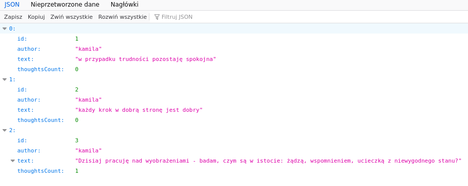

<!-- Improved compatibility of back to top link: See: https://github.com/othneildrew/Best-README-Template/pull/73 -->
<a name="readme-top"></a>
[![Forks][forks-shield]][forks-url]
[![Stargazers][stars-shield]][stars-url]
[![Issues][issues-shield]][issues-url]
[![MIT License][license-shield]][license-url]
[![LinkedIn][linkedin-shield]][linkedin-url]


<!-- PROJECT LOGO -->
<br />
<div align="center">
  <a href="https://github.com/kamchy/stoic_cafe">
    
  </a>

<h3 align="center">Stoic cafe</h3>

  <p align="center">
    This project helps you with your morning stoic meditation.
    <br />
    It provides services for storing, listing, adding quotes and attaching
    thoughts that come to your mind when meditatin on the quotes.
    <br />
    <a href="https://github.com/kamchy/stoic_cafe/issues">Report Bug</a>
    ·
    <a href="https://github.com/kamchy/stoic_cafe/features">Request Feature</a>
  </p>
</div>


<!-- TABLE OF CONTENTS -->
<details>
  <summary>Table of Contents</summary>
  <ol>
    <li>
      <a href="#about-the-project">About The Project</a>
      <ul>
        <li><a href="#built-with">Built With</a></li>
      </ul>
    </li>
    <li>
      <a href="#getting-started">Getting Started</a>
      <ul>
        <li><a href="#prerequisites">Prerequisites</a></li>
        <li><a href="#installation">Installation</a></li>
      </ul>
    </li>
    <li><a href="#usage">Usage</a></li>
    <li><a href="#roadmap">Roadmap</a></li>
    <li><a href="#contributing">Contributing</a></li>
    <li><a href="#license">License</a></li>
    <li><a href="#contact">Contact</a></li>
    <li><a href="#acknowledgments">Acknowledgments</a></li>
  </ol>
</details>


<!-- ABOUT THE PROJECT -->
## About The Project



This is my playground, nothing serious, just having fun and learning.
<p align="right">(<a href="#readme-top">back to top</a>)</p>


### Built With

* [![Spring Boot][boot.io]][Spring-boot]
* [![React][React.js]][React-url]
* [![Java][Java-badge]][Java-url]
* [![Docker][Docker-badge]][Docker-url]
* [![Postgresql][Postgres-badge]][postgres-url]
* [![Liquibase][Liquibase-badge]][Liquibase-url]
* [![Git][Git-badge]][Git-url]
* [![Maven][Maven-badge]][Maven-url]

<p align="right">(<a href="#readme-top">back to top</a>)</p>


<!-- GETTING STARTED -->
## Getting Started

You may try to build this project locally and start two containers: application container and and postgresql container. See `docker-compose.yaml` for details.

### Prerequisites

* docker
* maven 
* git 

### Installation

1. Clone the repo
   ```sh
   git clone https://github.com/kamchy/stoic_cafe.git
   ```
2. Build the app
   ```sh
   mvn clean package
   ```
1. Build images and run with
   ```sh
   docker compose up
   ```

<p align="right">(<a href="#readme-top">back to top</a>)</p>


<!-- USAGE EXAMPLES -->
## Usage

The goal of this project is to expose yourself to ancient wisdom of stoic philosophers. As an everyday practice,
you should pick a random quote (or whatever quote that resonates with the state of your mind) and write down all 
the things that come to your mind. This exercise will help you stay focused and will
bring stoic wisdom into your life, making you much calmer, much balanced and much happier human being.


<p align="right">(<a href="#readme-top">back to top</a>)</p>


<!-- ROADMAP -->
## Roadmap

- [ ] Add frontend 
  - [ ] display random quote
  - [ ] allow to change it
  - [ ] display related thoughts
  - [ ] allow to add thought related to a quote
- [ ] Allow browsing quotes
  - [ ] with attached thoughts
- [ ] Allow browsing thoughts
   -  [ ]  display quote (if  athought is related to it)
- [ ] Allow adding unrelated thoughts
    - [ ] export quotes and thoughts

See the [open issues](https://github.com/kamchy/stoic_cafe/issues) for a full list of proposed features (and known issues).

<p align="right">(<a href="#readme-top">back to top</a>)</p>


<!-- CONTRIBUTING -->
## Contributing

Contributions are what make the open source community such an amazing place to learn, inspire, and create. Any contributions you make are **greatly appreciated**.

If you have a suggestion that would make this better, please fork the repo and create a pull request. You can also simply open an issue with the tag "enhancement".
Don't forget to give the project a star! Thanks again!

1. Fork the Project
2. Create your Feature Branch (`git checkout -b feature/AmazingFeature`)
3. Commit your Changes (`git commit -m 'Add some AmazingFeature'`)
4. Push to the Branch (`git push origin feature/AmazingFeature`)
5. Open a Pull Request

<p align="right">(<a href="#readme-top">back to top</a>)</p>


<!-- LICENSE -->
## License

Distributed under the MIT License. See `LICENSE.txt` for more information.
<p align="right">(<a href="#readme-top">back to top</a>)</p>


<!-- CONTACT -->
## Contact

Project Link: [https://github.com/kamchy/stoic_cafe](https://github.com/kamchy/stoic_cafe)

Blog posts: 

 * [https://kamilachyla.com/en/docker-example](https://kamilachyla.com/en/docker-example)
 * [https://kamilachyla.com/en/docker-volumes](https://kamilachyla.com/en/docker-volumes)

<p align="right">(<a href="#readme-top">back to top</a>)</p>

<!-- MARKDOWN LINKS & IMAGES -->
<!-- https://www.markdownguide.org/basic-syntax/#reference-style-links -->
[contributors-shield]: https://img.shields.io/github/contributors/kamchy/stoic_cafe.svg?style=for-the-badge
[contributors-url]: https://github.com/kamchy/stoic_cafe/graphs/contributors
[forks-shield]: https://img.shields.io/github/forks/kamchy/stoic_cafe.svg?style=for-the-badge
[forks-url]: https://github.com/kamchy/stoic_cafe/network/members
[stars-shield]: https://img.shields.io/github/stars/kamchy/stoic_cafe.svg?style=for-the-badge
[stars-url]: https://github.com/kamchy/stoic_cafe/stargazers
[issues-shield]: https://img.shields.io/github/issues/kamchy/stoic_cafe.svg?style=for-the-badge
[issues-url]: https://github.com/kamchy/stoic_cafe/issues
[license-shield]: https://img.shields.io/github/license/kamchy/stoic_cafe.svg?style=for-the-badge
[license-url]: https://github.com/kamchy/stoic_cafe/blob/master/LICENSE.txt
[linkedin-shield]: https://img.shields.io/badge/-LinkedIn-black.svg?style=for-the-badge&logo=linkedin&colorB=555
[linkedin-url]: https://linkedin.com/in/kamila_chyla
[boot.io]: https://img.shields.io/badge/boot.io-000000?style=for-the-badge&logo=springboot&logoColor=6DB33F
[Spring-boot]: https://boot.io
[React.js]: https://img.shields.io/badge/React-20232A?style=for-the-badge&logo=react&logoColor=61DAFB
[React-url]: https://reactjs.org/
[Java-badge]: https://img.shields.io/badge/openjdk-35495E?style=for-the-badge&logo=openjdk&logoColor=0000
[Java-url]: https://docs.oracle.com/en/java/javase/17/docs/api/index.html
[Docker-badge]: https://img.shields.io/badge/docker-35495E?style=for-the-badge&logo=docker
[Docker-url]: https://docs.docker.com
[Postgres-badge]: https://img.shields.io/badge/postgresql-35495E?style=for-the-badge&logo=postgresql&logoColor=0000
[Postgres-url]: https://postgresql.org
[Git-badge]: https://img.shields.io/badge/git-35495E?style=for-the-badge&logo=git&logoColor=0000
[Git-url]: https://git-scm.org
[Maven-badge]: https://img.shields.io/badge/maven-35495E?style=for-the-badge&logo=maven&logoColor=0000
[Maven-url]: https://maven.org
[Liquibase-badge]: https://img.shields.io/badge/liquibase-35495E?style=for-the-badge&logo=liquibase&logoColor=0000
[Liquibase-url]: https://liquibase.org
